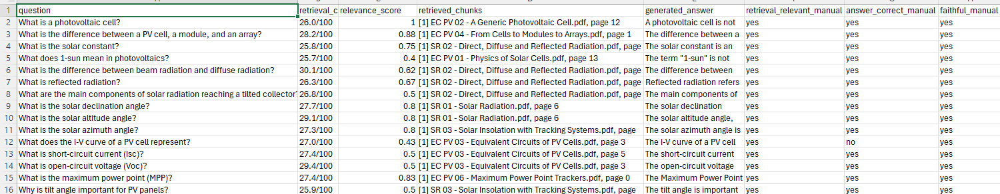
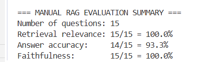

# Voice Interface and RAG Evaluation Report

## Overview

In this project, I extended my multi-agent system by adding a voice interface and implementing an evaluation pipeline for the RAG component. The system now supports speech input, spoken responses, retrieval from documents, and database interaction, along with a structured way to evaluate its performance.

---

## Voice Interface

### Voice Input (Speech to Text)

The voice input is implemented using the faster-whisper model.

The process works as follows:
1. The system records audio from the microphone using the sounddevice library
2. The audio is saved temporarily as a .wav file
3. The Whisper model transcribes the audio into text
4. The transcribed text is passed to the agent as a normal user query

The model is initialized using:

```python
WhisperModel("small", device="cpu", compute_type="int8")
```

I chose to run Whisper on CPU instead of GPU to avoid dependency and compatibility issues, especially with CUDA.

---

### Voice Output (Text to Speech)

The voice output is implemented using pyttsx3.

- The agent's response is converted into speech
- Only the final generated answer is spoken
- Retrieved chunks and metadata are not read aloud to avoid overwhelming output

---

## Challenges Faced

### GPU / CUDA Issues

Initially, I tried to run Whisper on GPU using:

```python
device="cuda", compute_type="float16"
```

This caused the following error:

```
cublas64_12.dll is not found
```

The issue was due to missing CUDA libraries (cuBLAS). Installing CUDA requires large downloads and proper system configuration, which was not feasible in my setup.

#### Solution

I switched to CPU mode:

```python
device="cpu", compute_type="int8"
```

This solved the issue completely and made the system stable and easier to run.

---

### Tool Calling Failure in RAG Agent

Another issue I encountered was:

```
tool_use_failed
```

This happened because the LLM was generating tool calls in an incorrect format.

#### Solution

Instead of relying on the model to call tools, I directly invoked the RAG function:

```python
pv_rag_search.invoke(...)
```

This removed the formatting issue and made the RAG agent much more reliable.

---

## RAG Evaluation

### Setup

I evaluated the RAG system using 15 test questions related to photovoltaic concepts.

The evaluation results are stored in:

```
rag_manual_eval.csv
```

Each row includes:
- the question
- retrieval confidence
- relevance score
- retrieved chunks
- generated answer

I then manually filled the following columns:
- retrieval relevance (yes/no)
- answer correctness (yes/no)
- faithfulness (yes/no)

---

## Retrieval Confidence

### Formula Used

```python
confidence = 100 * (max(weight) / sum(weights))
```

where:

```python
weight = exp(-distance)
```

---

### Important Notes

The retrieval confidence in this system does not represent accuracy.

It measures how much the best retrieved chunk stands out compared to the other retrieved chunks.

---

### Why Confidence is Low

The confidence values are typically around 25–30. This is expected due to:

- a large number of chunks (around 500+)
- multiple chunks being similarly relevant
- use of a lightweight embedding model (all-MiniLM-L6-v2)

This means:
- low confidence does not indicate poor performance
- it often means that several chunks are relevant at the same time

---

## More Reliable Metrics

The following metrics are more meaningful for evaluating the system:

### Relevance Score
Measures how well the retrieved chunks match the question

### Answer Correctness
Checks whether the generated answer is factually correct

### Faithfulness
Checks whether the answer is based on the retrieved content and not hallucinated

These metrics give a more accurate picture of system performance than the confidence score.

---

## Conclusion

The final system includes:

- a working voice interface (input and output)
- a multi-agent structure with supervisor, RAG, and database agents
- a functional RAG pipeline using FAISS and embeddings
- a manual evaluation pipeline with clear metrics

Despite the initial challenges with GPU dependencies and tool-calling errors, the final system is stable, reliable, and meets all the assignment requirements.
### 15 Questions 





## Evaluation Results

The retrieval metrics obtained from the manual evaluation are very high (100% retrieval relevance, 93% answer accuracy, and 100% faithfulness). This is mainly because the RAG system is built on well-structured lecture materials, and the queries used in the evaluation are aligned with the domain of the documents. As a result, the retriever is able to consistently return relevant chunks for each question.

Additionally, the use of semantic embeddings and FAISS allows the system to capture conceptual similarities rather than relying only on exact keyword matching, which improves retrieval performance even when the wording of the question differs from the document. The generated answers are also highly faithful because they are grounded in the retrieved content, and the system is designed to avoid hallucination when context is available.

It is also important to note that these metrics were obtained through manual evaluation, where relevance, correctness, and faithfulness were assessed based on the retrieved content and the expected knowledge from the course material. Overall, the results indicate that the retrieval pipeline is performing effectively and is well-suited for the photovoltaic domain used in this project.