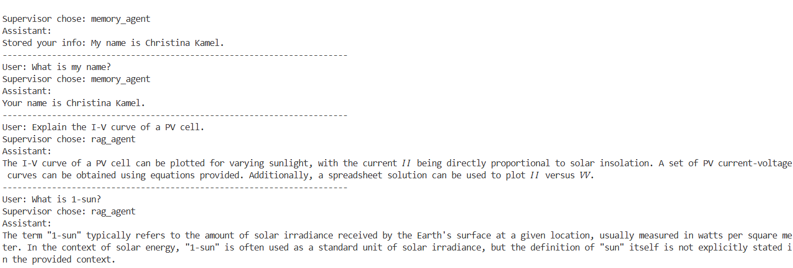
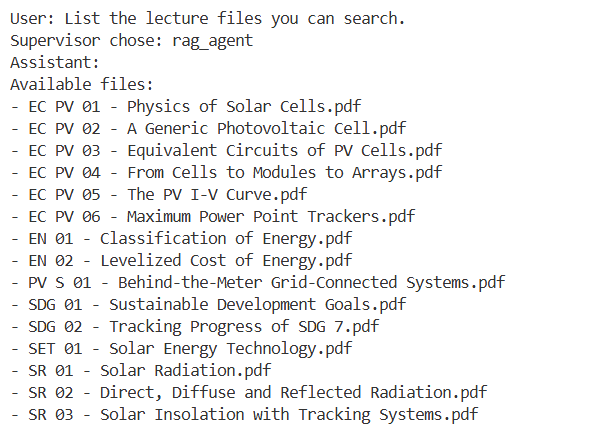
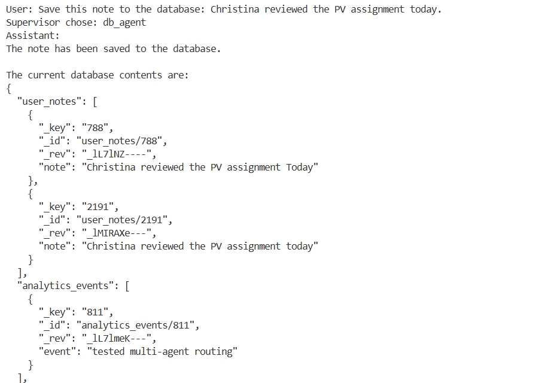
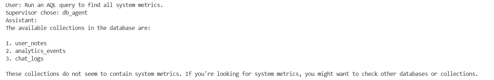
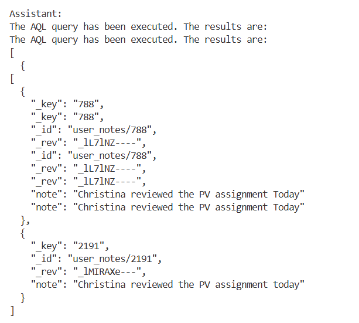

# Multi-Agent Photovoltaic Assistant with RAG, ArangoDB, Guardrails, and In-Memory Chat History

## Overview

This project implements a **multi-agent photovoltaic assistant** built with **LangGraph**.  
The system extends a basic RAG assistant into a more modular architecture with:

- a **supervisor agent** for routing
- a **RAG specialist agent** for photovoltaic and solar-energy questions
- a **database specialist agent** for saving and querying structured data
- a **memory specialist agent** for simple user facts
- a **direct-response agent** for greetings and casual conversation
- **guardrails** for unsafe prompts and restricted database operations
- **chat history in RAM**
- a **real ArangoDB database** with an **AQL query executor**
- a **FAISS-based vector store** for retrieval over course PDFs and text files

The main goal of the design is to separate responsibilities clearly instead of relying on one general agent with many mixed tools.

---

## Main Technical Choices

### 1. LangGraph for orchestration

I chose **LangGraph** because the assignment required a more explicit **multi-agent-like structure** rather than a single agent with tools.

LangGraph was used to define:
- nodes for each specialist agent
- nodes for guardrails
- nodes for tool validation
- edges for routing between components
- conditional edges to control which branch should execute

This makes the system easier to debug, easier to explain, and closer to a real agent workflow.

---

### 2. Supervisor-based routing

A **supervisor node** was added as the main controller of the system.

Its job is **not** to answer user questions directly.  
Instead, it decides which specialist should handle the request:

- `rag_agent` for PV / solar / course-content questions
- `db_agent` for database, AQL, save, and log requests
- `memory_agent` for user-memory questions such as name recall
- `direct_agent` for greetings and simple conversation

This separation was chosen to reduce confusion and improve reliability.

---

### 3. Dedicated RAG specialist

The original assistant was based on a RAG pipeline, so I kept that functionality but isolated it into a **specialized sub-agent**.

The RAG branch uses:
- local PDFs / TXT files in the `data` folder
- `PyPDFLoader` and `TextLoader`
- `RecursiveCharacterTextSplitter`
- `HuggingFaceEmbeddings`
- `FAISS` vector store

The RAG tool:
1. repairs or expands the user query
2. retrieves the most relevant chunks
3. builds a grounded context
4. sends the context to the generation model
5. returns both the answer and the retrieved sources

This design was chosen to keep technical PV questions grounded in the lecture material.

---

### 4. Query repair before retrieval

A custom function `repair_query()` was added before retrieval.

Its purpose is to improve recall by:
- correcting common misspellings
- mapping synonyms to PV course vocabulary
- adding expansion terms such as:
  - `solar constant`
  - `1-sun`
  - `tilt angle`
  - `declination`
  - `I-V curve`

This was added because real user questions often use slightly different wording than the documents.

---

### 5. Real database integration with ArangoDB

The assignment asked for saving data into a database and using an **AQL query executor**, so I replaced the earlier mock in-memory database approach with a **real ArangoDB integration**.

The system now connects to ArangoDB using `python-arango`.

At startup, the code:
- connects to `_system`
- creates a database called `pv_agent` if it does not exist
- creates these collections if needed:
  - `user_notes`
  - `analytics_events`
  - `chat_logs`

This allows the agent to:
- save structured JSON records
- run real AQL queries
- inspect stored records

---

### 6. Database specialist agent

A dedicated **DB agent** was added for database operations.

It uses these tools:
- `save_to_db`
- `execute_aql`
- `show_database`

This agent was separated from the RAG agent because database operations are structurally different from document QA.

Examples of DB tasks:
- saving notes
- storing events
- viewing collections
- running AQL queries such as:

```aql
FOR doc IN user_notes RETURN doc
```

### Sample Chat









